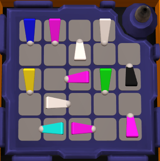

# Switch Placement

My fourth modded module for Keep Talking and Nobody Explodes, Switch Placement. Switch Placement is a module where a 5-by-5 grid is tiled with switches and must have all 12 switches set in the correct position to solve. RGB mixing and switch orientations are used in the calculations.